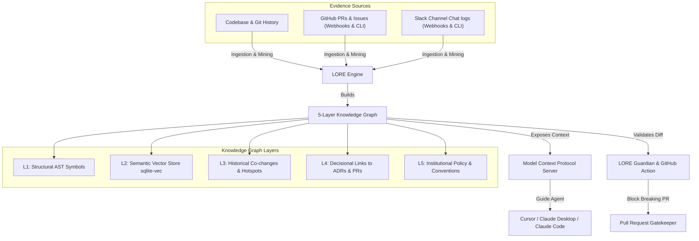

# 🚀 LORE: The Local Institutional Memory Layer for AI Coding Agents

**Stop AI from breaking your architecture. A 5-layer Knowledge Graph & Semantic Firewall for Cursor, Claude, and CI/CD.**

[](https://www.python.org/downloads/)
[](https://opensource.org/licenses/MIT)
[](https://modelcontextprotocol.io/)
[](https://github.com/filippogabriele19/lore/actions)

---

## 💡 The Problem: AI Code Amnesia

AI coding assistants (Cursor, Claude Code, Copilot, Devin) are incredibly good at writing syntax (the *what*), but they are completely blind to architectural intent and history (the *why*):
- They refactor key endpoints without knowing the performance constraints or GDPR policies behind them.
- They replace custom authentication schemes with standard ones, breaking compliance rules.
- They lack context on implicit dependencies and files that always co-evolve (co-changes), leading to silent regressions.

**When senior architects leave or team size grows, this knowledge debt leads to architectural decay.**

---

## 🎯 The Solution: LORE

LORE reconstructs intent from your codebase evidence—mining git history, commit messages, PRs, Slack/GitHub webhooks, and Architectural Decision Records (ADRs) into a structured **5-layer Knowledge Graph**. 

It serves as a **Semantic Firewall**, exposing this graph via **Model Context Protocol (MCP)** and a **GitHub Action** to guide AI agents and developers *before* they apply breaking changes.



---

## ⚡ Quick Start: Experience LORE in 60 Seconds

### 1. Install LORE
```bash
pip install git+https://github.com/filippogabriele19/lore.git
```

### 2. Initialize Workspace & Index Codebase
Set your LLM API key (e.g. Anthropic, OpenAI, DeepSeek, or OpenRouter):
```bash
export ANTHROPIC_API_KEY="your-api-key"
```

Then, run the bootstrap helper inside your repository to scan files and build your Knowledge Graph:
```bash
lore init .
```
*(If run interactively, LORE provides a guided console helper to set up your preferred provider and save keys securely in a local `.env` file).*

### 3. Query the Knowledge Graph
Ask questions about why the codebase is structured the way it is:
```bash
lore query "Why did we replace JWT with opaque tokens in auth.py?"
```

---

## ⚖️ What Makes LORE Different?

| Feature | Standard RAG / Code Search | AI IDE / Assistants | LORE |
| :--- | :---: | :---: | :---: |
| **AST Symbol Resolution** | ❌ (reads text chunks) | ❌ (raw file contents) | **✅ Full L1-L2 AST Graph** |
| **Understand *Why* (ADRs)** | ❌ | ❌ | **✅ L4 Decisional Linking** |
| **Co-Change Mapping** | ❌ | ❌ | **✅ Tracks Virtual Edges** |
| **AI Compliance Gate** | ❌ | ❌ | **✅ Pre-commit / CI/CD Firewall** |
| **Offline Vector Search** | ❌ (cloud dependency) | ❌ | **✅ Local via `sqlite-vec` (C)** |

---

## 🛠️ MCP Integration: Powering your AI Assistant

LORE exposes **10 specialized MCP tools** (including `lore_trace_taint`, `lore_comply_and_apply`, and `lore_get_architecture_constraints`) to prevent AI models from making uninformed edits.

### Integration with Cursor
1. Go to **Settings** -> **Features** -> **MCP**.
2. Click **+ Add New MCP Server**.
3. Configure:
   - **Name**: `LORE`
   - **Type**: `command`
   - **Command**: `python -m cli.mcp_server` (or absolute path to your virtual environment interpreter)

### Integration with Claude Desktop
Add LORE to your `claude_desktop_config.json`:
```json
{
  "mcpServers": {
    "lore": {
      "command": "python",
      "args": [
        "path/to/lore/lore.py",
        "mcp"
      ],
      "env": {
        "PYTHONPATH": "path/to/lore"
      }
    }
  }
}
```

---

## 🛡️ GitHub Action: The Semantic Pull Request Firewall

Integrate LORE Guardian into your CI/CD pipeline to automatically validate diffs against your semantic contracts:

```yaml
# .github/workflows/lore-audit.yml
name: LORE Security & Architecture Guard

on:
  pull_request:
    branches: [ main ]

jobs:
  lore-guard:
    runs-on: ubuntu-latest
    steps:
      - uses: actions/checkout@v4
        with:
          fetch-depth: 0 # Fetch all history for git mining

      - name: Run LORE Firewall
        uses: filippogabriele19/lore-action@v1
        with:
          github_token: ${{ secrets.GITHUB_TOKEN }}
          project: '.'
```

Whenever an agent or developer submits a PR that violates an active architectural rule, the LORE Action blocks the PR and comments on GitHub with the exact decision context:
> ❌ **PR BLOCKED by LORE Guardian**
>
> *The proposed change in `auth_handler.go` violates the architectural rule **ADR-042** (Opaque session tokens must be used instead of JWTs).*
>
> **Reason**: Compliance GDPR audit trails require session tokens to be revocable server-side.
> *Defined on 2025-11-03 in commit f8a21bc.*

---

## 📜 Contributing & License

For development setup instructions, please read [CONTRIBUTING.md](CONTRIBUTING.md).

LORE is open-source software licensed under the [MIT License](LICENSE).