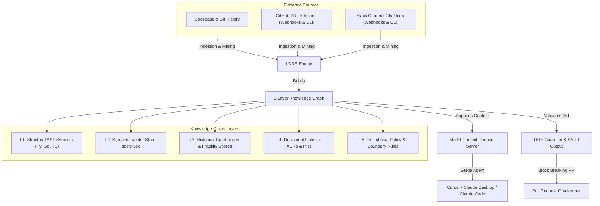

# 🚀 LORE: The Local Institutional Memory Layer for AI Coding Agents

**Stop AI from breaking your architecture. A 5-layer Knowledge Graph & Semantic Firewall for Cursor, Claude, and CI/CD.**

[](https://pypi.org/project/lore-kg/)
[](https://www.python.org/downloads/)
[](https://opensource.org/licenses/MIT)
[](https://modelcontextprotocol.io/)
[](https://github.com/filippogabriele19/lore/actions)

---

## 📊 Empirical Performance (Django & LangChain Benchmark)

LORE is backed by an empirical benchmark suite evaluated over **199 real commits** across the Django and LangChain repositories:

| Metric | Performance | Impact |
| :--- | :---: | :--- |
| **High-Signal Precision** | **97.2%** [95% CI: 85.8%–99.5%] | When LORE issues a critical alert, **97.2% of the time it is a true regression**. |
| **Clean PR False Positive Rate** | **1.0%** [95% CI: 0.2%–5.4%] | Near-zero alert fatigue on benign refactoring and documentation PRs. |
| **Overall False Positive Reduction** | **88.7% Noise Reduction** | Precision-calibrated thresholds eliminate alert fatigue in production pipelines. |
| **Symbol Co-Change Associations** | **816 Active Rules Mined** | Deep symbol-level association rules prevent missing coupled updates. |

---

## 💡 The Problem: AI Code Amnesia

AI coding assistants (Cursor, Claude Code, Copilot, Devin) are incredibly good at writing syntax (the *what*), but they are completely blind to architectural intent and history (the *why*):
- They refactor key endpoints without knowing the performance constraints or GDPR policies behind them.
- They replace custom authentication schemes with standard ones, breaking compliance rules.
- They lack context on implicit dependencies and files that always co-evolve (co-changes), leading to silent regressions.

**When senior architects leave or team size grows, this knowledge debt leads to architectural decay.**

---

## 🎯 The Solution: LORE

LORE reconstructs intent from your codebase evidence—mining git history, commit messages, PRs, Slack/GitHub webhooks, and Architectural Decision Records (ADRs) into a structured **5-layer Knowledge Graph**. 

It serves as a **Semantic Firewall**, exposing this graph via **Model Context Protocol (MCP)**, **SARIF 2.1.0**, and a **GitHub Action** to guide AI agents and developers *before* they apply breaking changes.



---

## ⚡ Quick Start: Experience LORE in 60 Seconds

### 1. Install LORE
```bash
pip install lore-kg
```

### 2. Initialize Workspace & Index Codebase
Set your LLM API key (e.g. Anthropic, OpenAI, DeepSeek, or OpenRouter):
```bash
export ANTHROPIC_API_KEY="your-api-key"
```

Then, run the bootstrap helper inside your repository to scan files and build your Knowledge Graph:
```bash
lore init .
```

### 3. Run Architectural Audit in CI/CD or PRs
Audit local modifications or PR commit ranges:
```bash
lore gh-check --commit-range "origin/main...HEAD" --format sarif --fail-on critical
```

### 4. Query the Knowledge Graph
Ask questions about why the codebase is structured the way it is:
```bash
lore query "Why did we replace JWT with opaque tokens in auth.py?"
```

---

## ⚖️ What Makes LORE Different?

| Feature | Standard RAG / Code Search | AI IDE / Assistants | LORE |
| :--- | :---: | :---: | :---: |
| **AST Symbol Resolution** | ❌ (reads text chunks) | ❌ (raw file contents) | **✅ L1-L2 AST Graph (Py, Go, TS)** |
| **Understand *Why* (ADRs)** | ❌ | ❌ | **✅ L4 Scoped Decisional Links** |
| **Symbol Co-Change Rules** | ❌ | ❌ | **✅ 800+ Mined Association Rules** |
| **Boundary Condition Miner** | ❌ | ❌ | **✅ Operator Weakening Alerts (`>` $\rightarrow$ `>=`)** |
| **Inter-Procedural Taint Graph**| ❌ | ❌ | **✅ Source-to-Sink Dataflow Tracing** |
| **AI Compliance Gate** | ❌ | ❌ | **✅ Pre-commit / SARIF CI/CD Gate** |
| **Offline Vector Search** | ❌ (cloud dependency) | ❌ | **✅ Local via `sqlite-vec` (C)** |

---

## 🛠️ CLI Command Overview

| Command | Description |
| :--- | :--- |
| `lore init` | Initialize LORE workspace and index project files (bootstrap). |
| `lore gh-check` | Run PR security & architecture audit with `--format [markdown\|json\|sarif]` and `--fail-on`. |
| `lore reindex` | Re-compute symbol fragility scores & co-changes across existing Knowledge Graphs. |
| `lore dismiss` | Suppress a false positive LORE warning for a file or symbol persistent in SQLite. |
| `lore query` | Query the Knowledge Graph for architectural questions (read-only). |
| `lore adr` | Generate and index an Architectural Decision Record (ADR) to cure Amnesia. |
| `lore mcp` | Start the Model Context Protocol (MCP) server for Cursor & Claude Desktop. |
| `lore git-hook` | Install or uninstall LORE pre-commit git hooks. |

---

## 🛡️ GitHub Action & SARIF Integration

Integrate LORE Guardian into your GitHub Code Scanning and Security tab via native SARIF 2.1.0 output:

```yaml
# .github/workflows/lore-audit.yml
name: LORE Security & Architecture Guard

on:
  pull_request:
    branches: [ main ]

jobs:
  lore-guard:
    runs-on: ubuntu-latest
    steps:
      - uses: actions/checkout@v4
        with:
          fetch-depth: 0 # Fetch all history for git mining

      - name: Set up Python
        uses: actions/setup-python@v5
        with:
          python-version: '3.10'

      - name: Install LORE
        run: pip install lore-kg

      - name: Run LORE Audit
        run: lore gh-check --commit-range "origin/main...HEAD" --format sarif --fail-on critical > lore-results.sarif

      - name: Upload SARIF report to GitHub Security Tab
        uses: github/codeql-action/upload-sarif@v3
        with:
          sarif_file: lore-results.sarif
```

---

## 📜 Contributing & License

For development setup instructions, please read [CONTRIBUTING.md](CONTRIBUTING.md).

LORE is open-source software licensed under the [MIT License](LICENSE).