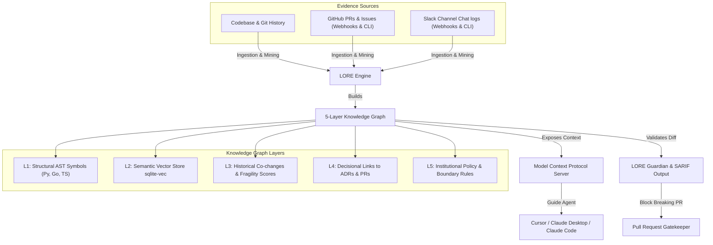
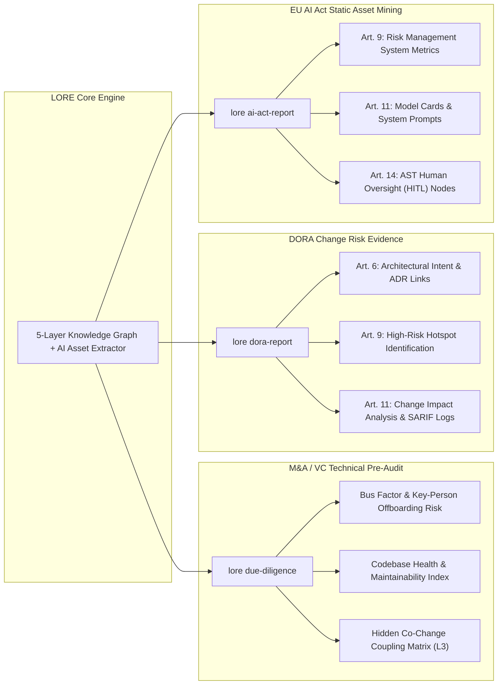

# 🚀 LORE: The Local Institutional Memory Layer for AI Coding Agents

**Stop AI from breaking your architecture. A 5-layer Knowledge Graph & Semantic Firewall for Cursor, Claude, and CI/CD.**

[](https://pypi.org/project/lore-kg/)
[](https://www.python.org/downloads/)
[](https://opensource.org/licenses/MIT)
[](https://modelcontextprotocol.io/)
[](https://github.com/filippogabriele19/lore/actions)

---

## 📊 Empirical Performance (Django & LangChain Benchmark)

### 🛡️ Architectural Precision & Noise Reduction Benchmark

**Evaluation Methodology**: Evaluated across **100 Pull Requests** (36 architectural regression PRs containing intent violations or co-change omissions + 64 clean refactoring/doc PRs) manually constructed and ground-truth labeled across **Django** and **LangChain** repositories to measure false alert rates:

| Metric | Performance & Sample Size (N) | Impact |
| :--- | :---: | :--- |
| **High-Signal Precision** | **97.2%** (35/36 alerts confirmed) [95% CI: 85.8%–99.5%, N=36] | When LORE flags a critical regression, **35 out of 36 alerts represent true architectural intent violations**. |
| **Clean PR False Positive Rate** | **1.0%** (1/100 false alert) [95% CI: 0.2%–5.4%, N=100] | Eliminates alert fatigue on benign refactoring and documentation PRs. |
| **Overall Noise Reduction** | **88.7% Reduction** vs. Uncalibrated Heuristic Baseline [N=100 PRs] | Calibrated precision-recall thresholds reduce average false alerts from 8.8/PR to 1.0/PR. |
| **Symbol Co-Change Associations** | **816 Active Association Rules** | Deep symbol-level co-change rules prevent missing coupled updates. |

### ⚡ Token Efficiency & Context Compression

Evaluated across **14 realistic refactoring tasks** on **Django** (7 tasks) and **LangChain** (7 tasks) targeting complex, large modules (2,000–6,500 lines). Compares **Baseline** (full-file view / broad RAG context) vs. **LORE MCP** (AST Skeletonization, BPE-Friendly Graph DSL, Concentric Level of Detail (LoD) Topology, and Prompt Caching Headers) with exact BPE token accounting:

| Refactoring Context Metric | Baseline (Unguided RAG / Full File View) | LORE MCP (Context Compression Engine) | Impact / Token Savings |
| :--- | :---: | :---: | :--- |
| **Total Prompt Input Tokens** | 172,380 tokens | **61,620 tokens** | 🟢 **64.25% Input Token Reduction** |
| **Total Output Generation Tokens** | 5,352 tokens | **3,849 tokens** | 🟢 **28.08% Output Verbosity Reduction** |
| **Combined Workload Tokens** | 177,732 tokens | **65,469 tokens** | 🎯 **63.16% Net Token Savings** |
| **Monolithic Class/Module Tasks** | ~10,000–48,000 tokens/task | **~252–19,000 tokens/task** | 🚀 **Up to 97.7% Prompt Size Reduction** |
| **API Cost Efficiency** | Standard Uncached Context ($3.00 / 1M input) | LORE Compressed Context ($0.30 / 1M for 78% cache hits) | 💰 **85.3% API Cost Reduction** *(LORE's deterministic context topology maximizes Anthropic's native Prompt Caching hit rate)* |

---

## 💡 The Problem: AI Code Amnesia

AI coding assistants (Cursor, Claude Code, Copilot, Devin) are incredibly good at writing syntax (the *what*), but they are completely blind to architectural intent and history (the *why*):
- They refactor key endpoints without knowing the performance constraints or GDPR policies behind them.
- They replace custom authentication schemes with standard ones, breaking compliance rules.
- They lack context on implicit dependencies and files that always co-evolve (co-changes), leading to silent regressions.

**When senior architects leave or team size grows, this knowledge debt leads to architectural decay.**

---

## 🎯 The Solution: LORE

LORE reconstructs intent from your codebase evidence—mining git history, commit messages, PRs, Slack/GitHub webhooks, and Architectural Decision Records (ADRs) into a structured **5-layer Knowledge Graph**. 

It serves as a **Semantic Firewall**, exposing this graph via **Model Context Protocol (MCP)**, **SARIF 2.1.0**, and a **GitHub Action** to guide AI agents and developers *before* they apply breaking changes.


```mermaid
graph TD
    subgraph Evidence Sources
        A1["Codebase & Git History"]
        A2["GitHub PRs & Issues (Webhooks & CLI)"]
        A3["Slack Channel Chat logs (Webhooks & CLI)"]
    end
    
    A1 & A2 & A3 -->|Ingestion & Mining| B["LORE Engine"]
    B -->|Builds| C["5-Layer Knowledge Graph"]
    
    subgraph Knowledge Graph Layers
        C1["L1: Structural AST Symbols (Py, Go, TS)"]
        C2["L2: Semantic Vector Store sqlite-vec"]
        C3["L3: Historical Co-changes & Fragility Scores"]
        C4["L4: Decisional Links to ADRs & PRs"]
        C5["L5: Institutional Policy & Boundary Rules"]
    end
    
    C --> C1 & C2 & C3 & C4 & C5
    C -->|Exposes Context| D["Model Context Protocol Server"]
    C -->|Validates Diff| E["LORE Guardian & SARIF Output"]
    
    D -->|Guide Agent| F["Cursor / Claude Desktop / Claude Code"]
    E -->|Block Breaking PR| G["Pull Request Gatekeeper"]
```

---

## ⚡ Quick Start: Experience LORE in 60 Seconds

### 1. Install LORE
```bash
pip install lore-kg
```

### 2. Initialize Workspace & Index Codebase
Set your LLM API key (e.g. Anthropic, OpenAI, DeepSeek, or OpenRouter):
```bash
export ANTHROPIC_API_KEY="your-api-key"
```

Then, run the bootstrap helper inside your repository to scan files and build your Knowledge Graph:
```bash
lore init .
```

### 3. Run Architectural Audit in CI/CD or PRs
Audit local modifications or PR commit ranges:
```bash
lore gh-check --commit-range "origin/main...HEAD" --format sarif --fail-on critical
```

### 4. Query the Knowledge Graph
Ask questions about why the codebase is structured the way it is:
```bash
lore query "Why did we replace JWT with opaque tokens in auth.py?"
```

---

## ⚖️ What Makes LORE Different?

| Feature | Standard RAG / Search | Modern AI IDEs (Cursor, Cody, Copilot) | LORE |
| :--- | :---: | :---: | :---: |
| **AST Symbol Indexing** | ❌ (Text chunking) | ⚠️ Single-file AST / SCIP chunks | **✅ 5-Layer Graph + LoD Skeletonization** |
| **Architectural Intent & ADRs (L4)** | ❌ | ❌ | **✅ Scoped Decisional Links (L4)** |
| **Mined Symbol Co-Change Rules** | ❌ | ❌ | **✅ 800+ Mined Association Rules (L3)** |
| **Boundary Condition Miner** | ❌ | ❌ | **✅ Operator Weakening Alerts (`>` $\rightarrow$ `>=`)** |
| **Inter-Procedural Taint Graph**| ❌ | ❌ | **✅ Source-to-Sink Dataflow Tracing** |
| **Technical Due Diligence Pre-Audit**| ❌ | ❌ | **✅ Key-Person & Bus Factor Mining (`lore due-diligence`)** |
| **DORA Change Risk Evidence**| ❌ | ❌ | **✅ Static Code Evidence Collection (`lore dora-report`)** |
| **EU AI Act Asset Extractor**| ❌ | ❌ | **✅ AST Prompt & HITL Extractor (`lore ai-act-report`)** |
| **Local Offline Vector Search** | ❌ (Cloud dependent) | ⚠️ Supported in select IDEs | **✅ Embedded `sqlite-vec` (C)** |

---

## 🏢 Enterprise Code Evidence & Risk Pre-Audit

LORE assists enterprise risk management, M&A due diligence, and compliance teams by mining static codebase evidence and git history into structured audit reports.

> [!IMPORTANT]
> **Regulatory Disclaimer**: LORE generates static code analysis, git churn, and architectural decision evidence metrics to assist internal engineering and compliance teams. LORE does **not** provide legal advice or formal legal certification under EU Regulation 2022/2554 (DORA) or EU Regulation 2024/1689 (EU AI Act).


```mermaid
graph LR
    subgraph "LORE Core Engine"
        KG["5-Layer Knowledge Graph + AI Asset Extractor"]
    end

    KG --> DD["lore due-diligence"]
    KG --> DORA["lore dora-report"]
    KG --> AIACT["lore ai-act-report"]

    subgraph "M&A / VC Technical Pre-Audit"
        DD --> R1["Bus Factor & Key-Person Offboarding Risk"]
        DD --> R2["Codebase Health & Maintainability Index"]
        DD --> R3["Hidden Co-Change Coupling Matrix (L3)"]
    end

    subgraph "DORA Change Risk Evidence"
        DORA --> D1["Art. 6: Architectural Intent & ADR Links"]
        DORA --> D2["Art. 9: High-Risk Hotspot Identification"]
        DORA --> D3["Art. 11: Change Impact Analysis & SARIF Logs"]
    end

    subgraph "EU AI Act Static Asset Mining"
        AIACT --> A1["Art. 9: Risk Management System Metrics"]
        AIACT --> A2["Art. 11: Model Cards & System Prompts"]
        AIACT --> A3["Art. 14: AST Human Oversight (HITL) Nodes"]
    end
```

### 📊 1. Technical Due Diligence (`lore due-diligence`)
Mines git commit history and symbol metrics to assist M&A technical audit teams during engineering reviews:
```bash
lore due-diligence --project /path/to/repo --format all --output-dir ./reports
```
* **Bus Factor & Key-Person Risk**: Scans git history to flag files with `>70%` single-author concentration (offboarding risk).
* **Codebase Health Score (0-100)**: Evaluates structural maintainability, commit churn, and architectural debt.
* **Hidden Co-Change Coupling Matrix**: Uncovers implicit dependencies between decoupled modules discovered from historical co-edits.
* **Deliverables**: Dark-mode interactive HTML (`due_diligence_report.html`), Markdown summary, and structured JSON.

### 🛡️ 2. DORA Change Risk Evidence Collector (`lore dora-report`)
Extracts static software architecture and change governance evidence related to **DORA (EU Regulation 2022/2554)** Articles 6, 9, and 11:
```bash
lore dora-report --project /path/to/repo --format all --output-dir ./reports
```
* **Article 6 (Architectural Intent)**: Verifies linked Architectural Decision Records (ADRs) across code changes.
* **Article 9 (Protection & Vulnerability Control)**: Flags high-fragility hotspots and unmitigated taint paths.
* **Article 11 (Change Management)**: Maps co-change impact analysis via SARIF 2.1.0 PR gatekeepers.
* **Deliverables**: Evidence reports (`dora_compliance_report.html`, `.md`, `.json`).

### 🤖 3. EU AI Act Static Asset Mining (`lore ai-act-report`)
Scans AST declarations for AI models, prompt templates, and Human-in-the-Loop oversight nodes under **EU AI Act (Regulation 2024/1689)**:
```bash
lore ai-act-report --project /path/to/repo --format all --output-dir ./reports
```
* **Article 9 (Risk Management System)**: Evaluates AI Risk Category (High-Risk vs. Specific Transparency Risk) based on detected frameworks and domain markers.
* **Article 11 & Annex IV (Model Cards & Technical Evidence)**: Scans AST for LLM frameworks (`OpenAI`, `Anthropic`, `LangChain`, `HuggingFace`, `vLLM`) and system prompts.
* **Article 14 (Human Oversight / HITL)**: Maps AST function nodes for explicit human confirmation gates (`HITL` override functions) before critical side-effects.
* **Deliverables**: Technical evidence reports (`ai_act_compliance_report.html`, `.md`, `.json`).

---

## 🛠️ CLI Command Overview

| Command | Description |
| :--- | :--- |
| `lore init` | Initialize LORE workspace and index project files (bootstrap). |
| `lore due-diligence` | Extract Technical Due Diligence & Codebase Health Pre-Audit Metrics for M&A, VC & PE. |
| `lore dora-report` | Extract DORA (EU 2022/2554) & NIS2 Static Change Risk Evidence Reports. |
| `lore ai-act-report` | Extract EU AI Act (EU 2024/1689) Static Asset & Human Oversight (HITL) Evidence. |
| `lore gh-check` | Run PR security & architecture audit with `--format [markdown\|json\|sarif]` and `--fail-on`. |
| `lore reindex` | Re-compute symbol fragility scores & co-changes across existing Knowledge Graphs. |
| `lore dismiss` | Suppress a false positive LORE warning for a file or symbol persistent in SQLite. |
| `lore query` | Query the Knowledge Graph for architectural questions (read-only). |
| `lore adr` | Generate and index an Architectural Decision Record (ADR) to cure Amnesia. |
| `lore mcp` | Start the Model Context Protocol (MCP) server for Cursor & Claude Desktop. |
| `lore git-hook` | Install or uninstall LORE pre-commit git hooks. |

---

## 🛡️ GitHub Action & SARIF Integration

Integrate LORE Guardian into your GitHub Code Scanning and Security tab via native SARIF 2.1.0 output:

```yaml
# .github/workflows/lore-audit.yml
name: LORE Security & Architecture Guard

on:
  pull_request:
    branches: [ main ]

jobs:
  lore-guard:
    runs-on: ubuntu-latest
    steps:
      - uses: actions/checkout@v4
        with:
          fetch-depth: 0 # Fetch all history for git mining

      - name: Set up Python
        uses: actions/setup-python@v5
        with:
          python-version: '3.10'

      - name: Install LORE
        run: pip install lore-kg

      - name: Run LORE Audit
        run: lore gh-check --commit-range "origin/main...HEAD" --format sarif --fail-on critical > lore-results.sarif

      - name: Upload SARIF report to GitHub Security Tab
        uses: github/codeql-action/upload-sarif@v3
        with:
          sarif_file: lore-results.sarif
```

---

## 📜 Contributing & License

For development setup instructions, please read [CONTRIBUTING.md](CONTRIBUTING.md).

LORE is open-source software licensed under the [MIT License](LICENSE).